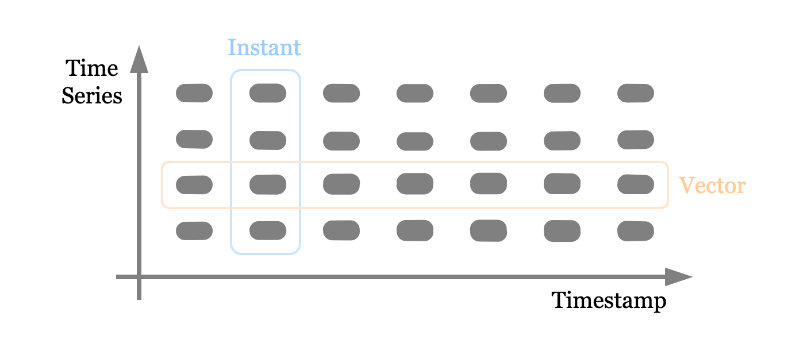

Rewrite PromQL in Rust
----------------------

# Summary
A Rust native implementation of PromQL, for GreptimeDB.

# Motivation
Prometheus and its query language PromQL prevails in the cloud-native observability area, which is an important scenario for time series database like GreptimeDB. We already have support for its remote read and write protocols. Users can now integrate GreptimeDB as the storage backend to existing Prometheus deployment, but cannot run PromQL query directly on GreptimeDB like SQL.

This RFC proposes to add support for PromQL. Because it was created in Go, we can't use the existing code easily. For interoperability, performance and extendability, porting its logic to Rust is a good choice.

# Details

## Overview
One of the goals is to make use of our existing basic operators, execution model and runtime to reduce the work. So the entire proposal is built on top of Apache Arrow DataFusion. The rewrote PromQL logic is manifested as `Expr` or `Execution Plan` in DataFusion. And both the intermediate data structure and the result is in the format of `Arrow`'s `RecordBatch`.

The following sections are organized in a top-down manner. First 

*This RFC is heavily related to Prometheus and PromQL. It won't repeat some basic concepts of them.*

## Evaluation

The original implementation is like an interpreter of parsed PromQL AST. It has two characteristics: (1) Operations are evaluated in place after they are parsed to AST. And some key parameters are separated from the AST because they do not present in the query, but come from other places like another field in the HTTP payload. (2) calculation is performed per timestamp. You can see this pattern many times:
```go
for ts := ev.startTimestamp; ts <= ev.endTimestamp; ts += ev.interval {}
```

These bring out two differences in the proposed implementation. First, to make it more general and clear, the evaluation procedure is reorganized into serval phases (and is the same as DataFusion's). And second, data are evaluated by time series (corresponding to "columnar calculation", if think timestamp as row number).

```
                                      Logic
   Query             AST              Plan
 ─────────► Parser ───────► Logical ────────► Physical ────┐
                            Planner           Planner      │
                                                           │
 ◄───────────────────────────── Executor  ◄────────────────┘
        Evaluation Result                     Execution
                                                Plan
```

- Parser 

    Provided by [`promql-parser`](https://github.com/GreptimeTeam/promql-parser) crate. Same as the original implementation.

- Logical Planner

    Generates a logical plan with all the needed parameters. It should accept something like `EvalStmt` in Go's implementation, which contains query time range, evaluation interval and lookback range.

    Another important thing done here is assembling the logic plan, with all the operations baked into logically. Like what's the filter and time range to read, how the data then flows through a selector into a binary operation, etc. Or what's the output schema of every single step. The generated logic plan is deterministic without variables, and can be `EXPLAIN`ed clearly.

- Physical Planner

    This step converts a logic plan into evaluatable execution plan. There are not many special things like the previous step. Except when a query is going to be executed distributedly. In this case, a logic plan will be divided into serval parts and sent to serval nodes. One physical planner only sees its own part.

- Executor

    As its name shows, this step calculates data to result. And all new calculation logic, the implementation of PromQL in rust, is placed here. And the rewrote functions are using `RecordBatch` and `Array` from `Arrow` as the intermediate data structure.

    Each "batch" contains only data from single time series. This is from the underlying storage implementation. Though it's not a requirement of this RFC, having this property can simplify some functions.
    
    Another thing to mention is the rewrote functions don't aware of timestamp or value columns, they are defined only based on the input data types. For example, `increase()` function in PromQL calculates the unbiased delta of data, its implementation here only does this single thing. Let's compare the signature of two implementations:

    - Go
        ```go
        func funcIncrease(vals []parser.Value, args parser.Expressions) Vector {}
        ```
    - Rust
        ```rust
        fn prom_increase(input: Array) -> Array {}
        ```

    Some unimportant parameters are omitted. The original Go version only writes the logic for `Point`'s value, either float or histogram. But the proposed rewritten one accepts a generic `Array` as input, which can be any type that suits, from `i8` to `u64` to `TimestampNanosecond`.

## Plan and Expression

They are structures to express logic from PromQL. The proposed implementation is built on top of DataFusion, thus our plan and expression are in form of `ExtensionPlan` and `ScalarUDF`. The only difference between them in this context is the return type: plan returns a record batch while expression returns a single column.

This RFC proposes to add four new plans, they are fundamental building blocks that mainly handle data selection logic in PromQL, for the following calculation expressions. 

- `SeriesNormalize`

    Sort data inside one series on the timestamp column, and bias "offset" if has. This plan usually comes after `TableScan` (or `TableScan` and `Filter`) plan.

- `VectorManipulator` and `MatrixManipulator`

    Corresponding to `InstantSelector` and `RangeSelector`. We don't calculate timestamp by timestamp, thus use "vector" instead of "instant", this image shows the difference. And "matrix" is another name for "range vector", for not confused with our "vector". The following section will detail how they are implemented using Arrow.

    

    Due to "interval" parameter in PromQL, data after "selector" (or "manipulator" here) are usually shorter than input. And we have to modify the entire record batch to shorten both timestamp, value and tag columns. So they are formed as plan.

- `PromAggregator`

    The carrier of aggregator expressions. This should not be very different from the DataFusion built-in `Aggregate` plan, except PromQL can use "group without" to do reverse selection.

PromQL has around 70 expressions and functions. But luckily we can reuse lots of them from DataFusion. Like unary expression, binary expression and aggregator. We only need to implement those PromQL-specific expressions, like `rate` or `percentile`. The following table lists some typical functions in PromQL, and their signature in the proposed implementation. Other function should be the same.

| Name               	| In Param(s)                                          	| Out Param(s) 	| Explain            	|
|--------------------	|------------------------------------------------------	|--------------	|--------------------	|
| instant_delta      	| Matrix T                                             	| Array T      	| idelta in PromQL   	|
| increase           	| Matrix T                                             	| Array T      	| increase in PromQL 	|
| extrapolate_factor 	| - Matrix T<br>- Array Timestamp<br>- Array Timestamp 	| Array T      	| *                   	|

*: *`extrapolate_factor` is one of the "dark sides" in PromQL. In short it's a translation of this [paragraph](https://github.com/prometheus/prometheus/blob/0372e259baf014bbade3134fd79bcdfd8cbdef2c/promql/functions.go#L134-L159)*


## Data Preparation

Corresponding to PromQL's `populateSeries` procedure. This step will be translated into two or three logical plan nodes
- `TableScan`: Read the data from table. This is a standard table scan operation.
- `SeriesNormalize`
- `Filter`: To ensure the result of is correct, an extra `Filter` node may also be required if the table implement cannot perform "exact" filter.

This step reads data from the underlying table. And to simplify this procedure, assumes the returned data is already organized (grouped) in time series format.

`SeriesNormalize` is a "extension plan" proposed in this RFC. It handles the logic like offset, look back, alignment, etc in PromQL. And more to support the following columnar evaluation.

TODO: detail this section

## Data Model

Four basic types:
- Scalar
- String
- Instant Vector
- Range Vector

To maximize the performance, I propose to perform calculation in columnar, rather than by timestamp like PromQL. Which means both instant vector and range vector cannot be transplanted as-is.

# Drawbacks

Human-being is always error-prone. It's harder to endeavor to rewrite from the ground and requires more attention to ensure correctness, than translate line-by-line. And, since the evaluator's architecture are different, it might be painful to catch up with PromQL's breaking update (if any) in the future.

# Alternatives

There are a few alternatives we've considered:
- Wrap the existing PromQL's implementation via FFI, and import it to GreptimeDB.
- Translate its evaluator engine line-by-line, rather than rewrite one.
- Integrate the Prometheus server into GreptimeDB via RPC, making it a detached execution engine for PromQL.

The first and second options are making a separate execution engine in GreptimeDB, they may alleviate the pain during rewriting, but will have negative impacts to afterward evolve like resource management. And introduce another deploy component in the last option will bring a complex deploy architecture.

And all of them are more or less redundant in data transportation that affects performance and resources. The proposed built-in executing procedure is also easy to integrate and expose to the existing SQL interface GreptimeDB currently provides. Some concepts in PromQL like sliding windows (range vector in PromQL) are very convenient and ergonomic in analyzing series data. This makes it not only a PromQL evaluator, but also an enhancement to our query system.